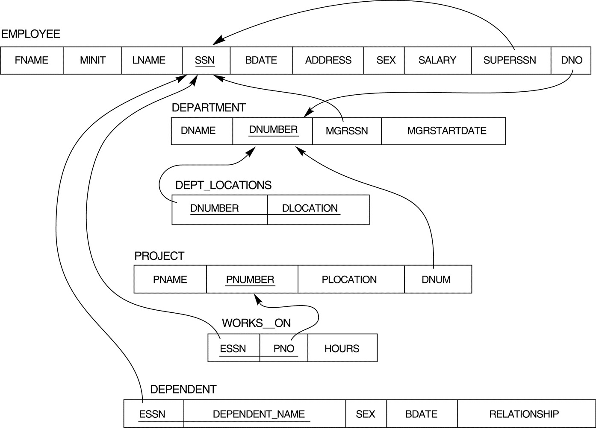
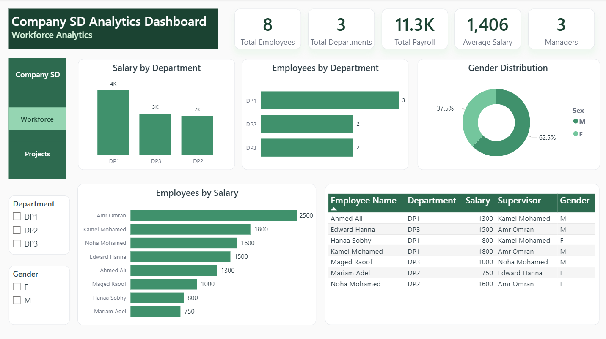
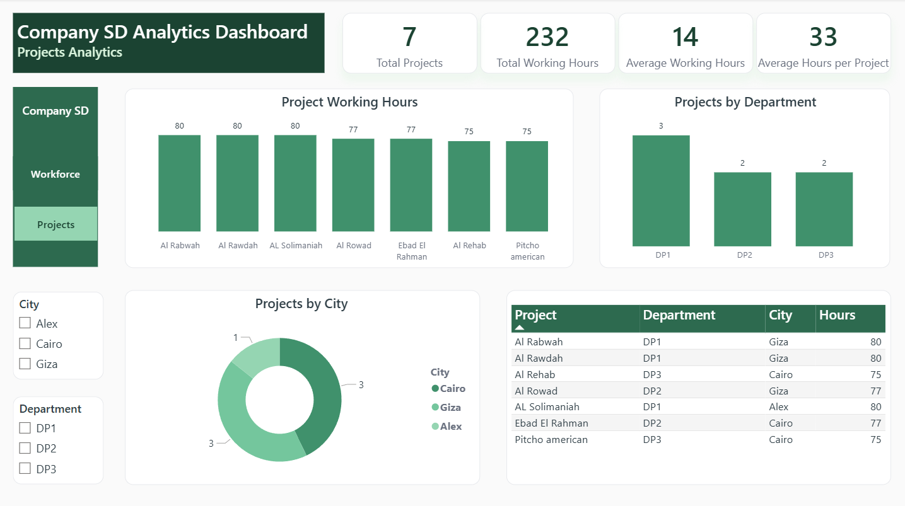

# 🏢 Company SD Analytics Dashboard

An interactive **Company Workforce & Projects Analytics Dashboard** built using **Power BI, Microsoft SQL Server, SQL, Power Query, and DAX** to transform relational company data into meaningful business insights.

The project analyzes employees, departments, salaries, managers, supervisors, projects, working hours, employee-project assignments, and dependents through interactive dashboards and business-focused SQL analysis.

The solution demonstrates an end-to-end Business Intelligence workflow, from relational data analysis and SQL querying to data modeling, DAX calculations, and interactive Power BI reporting.

---

## 📑 Table of Contents

- Project Overview
- Business Objectives
- Dataset
- Data Model
- Dashboard Pages
- Workforce Analytics
- Projects Analytics
- Dashboard KPIs
- SQL Business Analysis
- SQL Techniques Demonstrated
- DAX Measures
- Interactive Analysis
- Data Quality Considerations
- Business Analysis Structure
- Business Questions Answered
- Key Business Insights
- Skills Demonstrated
- Business Value
- Repository Structure
- How to Explore the Project
- Future Improvements
- Author

---

## 📌 Project Overview

**Company SD Analytics Dashboard** is a Business Intelligence project based on a relational company database containing information about employees, departments, projects, dependents, and employee-project assignments.

The project combines **Microsoft SQL Server, SQL, Power Query, DAX, and Power BI** to transform relational business data into an interactive analytical reporting solution.

The dashboard focuses on two main business areas:

- **Workforce Analytics**
- **Projects Analytics**

The Workforce Analytics page provides insights into employee distribution, salary structure, departments, gender distribution, managers, supervisors, and employee-level information.

The Projects Analytics page analyzes project distribution, project working hours, departmental involvement, and project locations.

In addition to the Power BI dashboard, the project includes **56 SQL queries** covering basic, intermediate, advanced, and business-oriented analytical questions.

---

## 🎯 Business Objectives

The main objectives of the project are to:

- Monitor the overall workforce structure.
- Analyze salary distribution across departments.
- Compare employee counts between departments.
- Analyze employee gender distribution.
- Identify department managers and supervisors.
- Analyze employees reporting to each supervisor.
- Monitor employee-dependent relationships.
- Identify employees without an assigned department.
- Analyze project distribution across departments.
- Monitor total and average project working hours.
- Compare project activity across departments.
- Analyze projects by city.
- Understand relationships between employees, departments, and projects.
- Answer detailed business questions using SQL.
- Support business analysis through interactive Power BI reporting.

---

## 📂 Dataset

The project is based on the **Company SD relational database**.

The database represents a company's organizational structure, workforce, departments, projects, employee-project assignments, department locations, and employee dependents.

### Main Entities

- **Employee**
- **Department**
- **Project**
- **Works_For**
- **Dependent**
- **Dept_Locations**

These entities provide the information required to analyze workforce structure, organizational hierarchy, salaries, projects, working hours, locations, and employee dependents.

---

## 🗂️ Data Model

### Company SD Relational Data Model



The project uses a relational data model based on primary and foreign key relationships between the Company SD entities.

The data model connects employees, departments, projects, supervisors, employee-project assignments, department locations, and dependents.

### Employee

Contains employee-level information such as:

- Employee First Name
- Employee Last Name
- SSN
- Birth Date
- Address
- Gender
- Salary
- Supervisor SSN
- Department Number

### Department

Contains department information including:

- Department Name
- Department Number
- Manager SSN
- Manager Start Date

### Project

Contains project information including:

- Project Name
- Project Number
- Project Location
- Department Number
- City

### Works_For

Acts as an assignment entity connecting employees with projects and contains:

- Employee SSN
- Project Number
- Working Hours

### Dependent

Contains employee dependent information including:

- Employee SSN
- Dependent Name
- Gender
- Birth Date
- Relationship

### Dept_Locations

Contains department location information including:

- Department Number
- Department Location

---

## 🔗 Data Relationships

The relational structure allows the dashboard and SQL analysis to explore the company from multiple perspectives.

Key relationships include:

- **Employees → Departments**
- **Employees → Supervisors**
- **Departments → Managers**
- **Departments → Projects**
- **Departments → Locations**
- **Employees → Projects through Works_For**
- **Employees → Dependents**

The Employee table also contains a self-referencing relationship through the supervisor SSN, allowing the organizational reporting structure to be analyzed.

---

## 📊 Dashboard Pages

The Power BI report consists of **two interactive dashboard pages**, each focused on a specific business area.

### 1. Workforce Analytics



Focuses on:

- Employees
- Salaries
- Departments
- Gender
- Managers
- Supervisors
- Workforce structure

### 2. Projects Analytics



Focuses on:

- Projects
- Working Hours
- Departments
- Cities
- Employee-project assignments

Interactive navigation allows users to move between the **Workforce Analytics** and **Projects Analytics** pages.

---

# 👥 Workforce Analytics

The Workforce Analytics dashboard provides an overview of the company's employee structure and salary distribution.

### Dashboard Highlights

- Total Employees
- Total Departments
- Total Payroll
- Average Salary
- Managers
- Salary by Department
- Employees by Department
- Gender Distribution
- Employees by Salary
- Employee Details
- Supervisor Information

### Interactive Filters

The dashboard includes interactive filters for:

- Department
- Gender

These filters allow users to dynamically analyze the workforce based on organizational and demographic dimensions.

### Workforce Visualizations

The dashboard includes:

- **Salary by Department** — compares total salary across departments.
- **Employees by Department** — shows employee distribution by department.
- **Gender Distribution** — presents the workforce gender composition.
- **Employees by Salary** — ranks employees based on salary.
- **Employee Details Table** — provides employee-level information including department, salary, supervisor, and gender.

---

# 📁 Projects Analytics

The Projects Analytics dashboard focuses on project activity, working hours, departmental involvement, and project locations.

### Dashboard Highlights

- Total Projects
- Total Working Hours
- Average Working Hours
- Average Hours per Project
- Project Working Hours
- Projects by Department
- Projects by City
- Project Details Table

### Interactive Filters

The dashboard includes interactive filters for:

- City
- Department

These filters allow users to explore project activity across different locations and organizational units.

### Project Visualizations

The dashboard includes:

- **Project Working Hours** — compares total working hours across projects.
- **Projects by Department** — shows project distribution across departments.
- **Projects by City** — shows project distribution across locations.
- **Project Details Table** — provides project-level information including project name, department, city, and working hours.

---

## 🎨 Dashboard Design

The dashboard uses a professional **green / emerald visual theme** to create a consistent and modern portfolio presentation.

The visual design includes:

- Dark Emerald dashboard headers
- Forest Green navigation
- Sage Green active navigation states
- Emerald chart elements
- Light Sage secondary elements
- White analytical cards
- Light gray borders
- Dark charcoal text
- Consistent typography
- Consistent spacing and alignment

The report also includes interactive page navigation between:

**Workforce Analytics ↔ Projects Analytics**

---

## 📊 Dashboard KPIs

The dashboard uses dynamic KPI cards to provide a quick overview of workforce and project performance.

### Workforce KPIs

| KPI | Description |
|---|---|
| 👥 Total Employees | Total number of employees in the company |
| 🏢 Total Departments | Total number of departments |
| 💰 Total Payroll | Total salary amount across employees |
| 💵 Average Salary | Average employee salary |
| 👔 Managers | Number of department managers |

### Projects KPIs

| KPI | Description |
|---|---|
| 📁 Total Projects | Total number of projects |
| ⏱️ Total Working Hours | Total hours recorded across employee-project assignments |
| 📊 Average Working Hours | Average working hours recorded |
| 📌 Average Hours per Project | Average working hours allocated to each project |

---

# 🗃️ SQL Business Analysis

The project includes a comprehensive SQL analysis containing **56 SQL queries** covering basic, intermediate, advanced, and analytical business questions.

The queries were developed using **Microsoft SQL Server** and demonstrate practical SQL techniques for analyzing the Company SD relational database.

---

## 🔹 Basic SQL Analysis

The basic analysis covers:

- Department information
- Employee information
- Manager information
- Salary filtering
- Salary ranges
- Employee supervisors
- Pattern matching using `LIKE`
- Project and department relationships
- Annual salary calculations
- Employee gender analysis
- Department managers
- Department-controlled projects

---

## 🔹 Intermediate SQL Analysis

The intermediate analysis covers:

- Department managers and employees
- Departments and their projects
- Employees and dependents
- Projects by location
- Projects by name pattern
- Department salary analysis
- Employee-project assignments
- Supervisor analysis
- Salary comparisons
- Maximum and minimum salaries
- Department salary averages

---

## 🔹 Advanced SQL Analysis

The advanced analysis covers:

- Employee-project relationships
- Project manager information
- Employees who are both managers and supervisors
- Employees who are managers or supervisors
- Supervisors who are not department managers
- Employees without dependents
- Department analysis using subqueries
- Multiple join types
- Self-referencing employee relationships
- Cross joins
- Employees with multiple dependents

---

## 🔹 Advanced Business Challenges

The SQL analysis also includes more complex business questions such as:

- Employees and dependents with matching gender
- Total working hours by project
- Department of the employee with the minimum SSN
- Maximum, minimum, and average salary by department
- Managers and supervisors without dependents
- Departments with below-company-average salaries
- Employees and their assigned projects
- Employees with the third-highest salary
- Employees whose first name appears in a dependent's name
- Salary updates for employees working on a specific project
- Employees with at least one dependent

---

# 🧠 SQL Techniques Demonstrated

The SQL analysis demonstrates a broad range of SQL concepts.

### Query Fundamentals

- `SELECT`
- `WHERE`
- `ORDER BY`
- `LIKE`
- `BETWEEN`
- `IN`

### Joins

- `INNER JOIN`
- `LEFT OUTER JOIN`
- `RIGHT OUTER JOIN`
- `FULL OUTER JOIN`
- `SELF JOIN`
- `CROSS JOIN`

### Aggregation

- `COUNT()`
- `SUM()`
- `AVG()`
- `MAX()`
- `MIN()`
- `GROUP BY`
- `HAVING`

### Advanced SQL

- Subqueries
- `EXISTS`
- `UNION`
- `INTERSECT`
- `EXCEPT`
- Correlated filtering
- Aggregate subqueries
- Multi-table joins
- Conditional filtering

### Data Modification

- `UPDATE`

The SQL scripts demonstrate how relational data can be transformed into business-oriented answers using structured SQL logic.

---

# 📐 DAX Measures

Custom DAX measures were created in Power BI to support dynamic KPI calculations and dashboard visualizations.

### Workforce Measures

Key workforce measures include:

- Total Employees
- Total Departments
- Total Payroll
- Average Salary
- Managers
- Employees with Dependents
- Employees without Dependents
- Employees without Department
- Employees by Supervisor

### Project Measures

Key project measures include:

- Total Projects
- Total Working Hours
- Average Working Hours
- Average Hours per Project

These measures dynamically respond to report filters and slicers, allowing users to analyze the data interactively.

---

# 🔄 Interactive Analysis

The Power BI report supports interactive analysis through:

- Department filtering
- Gender filtering
- City filtering
- Cross-filtering between visuals
- Dynamic KPI calculations
- Interactive page navigation

Selecting a department, gender, or city allows users to explore the corresponding workforce or project information throughout the dashboard.

---

# 🔎 Data Quality Considerations

During the analysis, the dataset was reviewed for organizational data consistency.

One employee does not have a department number assigned.

This employee is part of the organizational supervision structure but does not belong to a department.

Therefore, visuals that analyze employees by department may exclude or separately represent this employee as a blank department rather than incorrectly assigning the employee to an existing department.

This provides an additional workforce data-quality insight through the:

**Employees without Department**

KPI.

---

# 🧩 Business Analysis Structure

The project separates the analysis into two complementary perspectives.

### Workforce Perspective

Focuses on:

- Employees
- Salaries
- Departments
- Gender
- Managers
- Supervisors
- Dependents

### Project Perspective

Focuses on:

- Projects
- Working Hours
- Departments
- Cities
- Employee-project assignments

Together, these perspectives provide a broader understanding of both the company's organizational structure and its project operations.

---

# ❓ Business Questions Answered

The Company SD Analytics Dashboard and SQL analysis answer a wide range of workforce and project-related business questions.

## 👥 Workforce Analysis

- How many employees are in the company?
- How many departments does the company have?
- What is the total payroll?
- What is the average employee salary?
- How are employees distributed across departments?
- Which department has the highest total payroll?
- What is the average salary for each department?
- How are employee salaries distributed?
- Which employees have the highest salaries?
- How are employees distributed by gender?
- Who are the department managers?
- Which employees are supervisors?
- Which employees are both department managers and supervisors?
- Which supervisors are not department managers?
- Which employees have dependents?
- Which employees do not have dependents?
- Which employees do not have an assigned department?
- Which departments have an average salary below the overall company average?

## 📁 Project Analysis

- How many projects are in the company?
- How many working hours are recorded across all projects?
- What is the total working time for each project?
- Which project has the highest total working hours?
- How are projects distributed across departments?
- How are projects distributed across cities?
- Which projects are located in Cairo?
- Which projects are located in Alex?
- Which projects are located in Giza?
- Which employees are assigned to each project?
- How many employees are assigned to each project?
- Which employees work on a specific project?
- How are employee working hours distributed across projects?

## 👨‍👩‍👧 Employee & Dependent Analysis

- Which employees have at least one dependent?
- Which employees have three or more dependents?
- Which employees have no dependents?
- Which employees have dependents with the same gender?
- Which employees have a first name appearing in one of their dependent names?

## 💰 Salary Analysis

- Which employees earn more than a specific employee?
- Which employees earn more than every employee in a specific department?
- What is the maximum salary?
- What is the minimum salary?
- What is the average salary?
- Which employees have the third-highest salary?
- What are the maximum, minimum, and average salaries for each department?

---

# 💡 Key Business Insights

The analysis provides insights into the company's workforce structure, salary distribution, organizational hierarchy, and project operations.

## Workforce Insights

- The Company SD dataset contains **8 employees** across **3 departments**.
- Employee salaries range from approximately **750 to 2,500**.
- Total payroll is approximately **11.3K**.
- The average employee salary is approximately **1,406**.
- The workforce can be analyzed by department, gender, salary, and supervisor.
- The company has an organizational hierarchy in which employees can report to supervisors.
- Department managers can be identified through the relationship between the Employee and Department entities.
- Employee-dependent relationships provide additional workforce information.
- One employee does not have an assigned department number. This should be treated as a data-quality consideration rather than automatically assigning the employee to another department.

## Project Insights

- The Company SD dataset contains **7 projects**.
- Projects are distributed across the company's **3 departments**.
- Projects are located across **Cairo, Alex, and Giza**.
- The dataset contains **232 total working hours** across employee-project assignments.
- Working hours can be analyzed at the project level to identify projects requiring greater employee effort.
- The `Works_For` entity connects employees with projects and provides the working-hours information required for project workload analysis.
- Employee-project relationships allow the company to understand how its workforce is distributed across different projects.
- Comparing projects by department and city provides additional visibility into the company's operational structure.

---

# 🛠️ Skills Demonstrated

## SQL

- SELECT
- WHERE
- ORDER BY
- LIKE
- BETWEEN
- IN
- INNER JOIN
- LEFT OUTER JOIN
- RIGHT OUTER JOIN
- FULL OUTER JOIN
- SELF JOIN
- CROSS JOIN
- GROUP BY
- HAVING
- Aggregate Functions
- Subqueries
- EXISTS
- UNION
- INTERSECT
- EXCEPT
- UPDATE

## Power BI

- Data Modeling
- Relationship Management
- DAX Measures
- KPI Development
- Interactive Dashboard Design
- Multi-page Reports
- Slicers
- Cross-filtering
- Page Navigation
- Tables
- Bar Charts
- Column Charts
- Donut Charts

## Power Query

- Data Preparation
- Data Transformation
- Data Type Management
- Query Editing
- Data Loading

## Business Analytics

- Workforce Analytics
- Salary Analysis
- Department Analysis
- Organizational Structure Analysis
- Supervisor Analysis
- Employee-Dependent Analysis
- Project Analytics
- Working Hours Analysis
- Project Distribution Analysis
- Location Analysis
- Data Quality Analysis

---

# 💼 Business Value

The Company SD Analytics Dashboard transforms relational company data into an interactive Business Intelligence solution that can support workforce and project-related decision-making.

The solution enables stakeholders to:

- Monitor workforce size and organizational structure.
- Understand total payroll and salary distribution.
- Compare salary performance across departments.
- Identify department managers and supervisors.
- Analyze employee distribution by department and gender.
- Understand employee-project assignments.
- Monitor project working hours.
- Compare projects across departments.
- Analyze project locations across cities.
- Identify missing organizational information within the dataset.
- Use SQL analysis to answer detailed business questions.
- Explore workforce and project information interactively through Power BI.

By combining **SQL analysis**, **relational data modeling**, **DAX**, **Power Query**, and **Power BI visualization**, the project demonstrates how structured database information can be transformed into meaningful business insights.

---

## 📂 Repository Structure

```text
Company-SD-SQL-Project/
│
├── README.md
│
├── Assets/
│   ├── 1_Workforce_Analytics.png
│   ├── 2_Projects_Analytics.png
│   └── Company_SD_ERD.png
│
├── Dashboard/
│   └── Company-SD-SQL-Project.pdf
│
└── SQL/
    └── Company_SD_SQL_Project.sql
```

---

## 🚀 How to Explore the Project

### 1. Review the Dashboard

Open the complete dashboard report located in:

`Dashboard/Company-SD-SQL-Project.pdf`

The PDF contains the two Power BI dashboard pages:

- **Workforce Analytics**
- **Projects Analytics**

### 2. Explore the Dashboard Screenshots

The dashboard screenshots are available in the `Assets` folder:

- `1_Workforce_Analytics.png`
- `2_Projects_Analytics.png`
- `Company_SD_ERD.png`

These screenshots provide a visual overview of the dashboard layout, KPIs, charts, tables, filters, and interactive navigation.

### 3. Review the Data Model

The relational database structure is available in:

`Assets/Company_SD_ERD.png`

The **Company SD Relational Data Model** illustrates the relationships between the main database entities, including:

- Employee
- Department
- Project
- Works_For
- Dependent
- Dept_Locations

The data model provides the foundation for both the SQL analysis and Power BI reporting.

### 4. Explore the SQL Analysis

The complete SQL analysis is available in:

`SQL/Company_SD_SQL_Project.sql`

The SQL file contains **56 SQL queries** organized into four analytical sections:

- Basic SQL Queries
- Intermediate SQL Queries
- Advanced SQL Queries
- Advanced SQL Challenges

The analysis covers:

- Employee analysis
- Department analysis
- Salary analysis
- Manager and supervisor analysis
- Dependent analysis
- Project analysis
- Employee-project assignments
- Working-hours analysis
- Relational joins
- Subqueries
- Set operators
- Data modification

### 5. Follow the Analytical Workflow

The project follows an end-to-end Business Intelligence workflow:

**Company SD Relational Database → SQL Analysis → Data Preparation → Data Modeling → DAX Measures → Power BI Dashboard → Business Insights**

This workflow demonstrates how relational database information can be transformed into an interactive Business Intelligence solution.

## 🔮 Future Improvements

Potential future enhancements for the project include:

- Employee tenure analysis
- Salary distribution by gender
- Employee workload analysis
- Project workload analysis by employee
- Department-level project performance metrics
- Additional workforce KPIs
- Employee-level drill-through pages
- Project-level drill-through pages
- Additional advanced DAX measures
- Expanded data-quality checks
- Additional SQL analytical queries
- Power BI Service deployment
- Automated data refresh
- Mobile dashboard optimization
- Additional business-focused analytical views

---

## 👤 Author

**Omnia Mohamed**

Data Analyst

💼 [LinkedIn](https://www.linkedin.com/in/omnia26)  
🐙 [GitHub](https://github.com/omnia-mohamed26)

---

## ⭐ Support

If you find this project useful or interesting, please consider giving the repository a Star ⭐.

Thank you for exploring the **Company SD Analytics Dashboard**!
